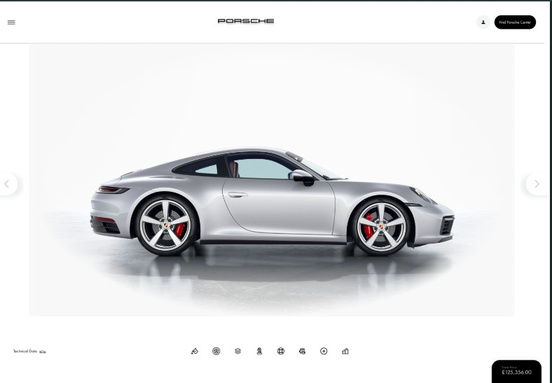

# lima.porche
TRABALHO FINAL - Criação de Site Porsche utilizando TailWind

# Tecnologias Utilizadas
    - Framework-Tailwind
    - HTML5
    - Github
    - Configurações avançadas de Navegador
    - Realização em multiplos Sistemas Operacionais (MacOS, Linux e Windows)
    - Figma

# Descrição
    O Prazo para a realização desse projeto foi de 1 semana, tendo em vista a organização,
    eficiência e autonomia do profissional em aprender em um curto prazo a utilizar
    com segurança recursos avançados de uma nova tecnologia.
    
                    
                    Realização: Matheus Perez
